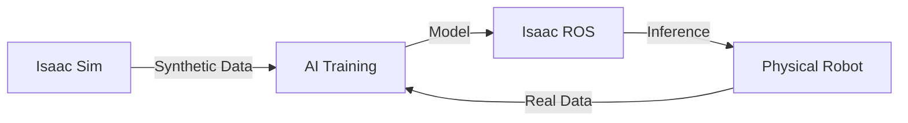

# NVIDIA Isaac Overview

## The Isaac Platform

NVIDIA Isaac is a powerful end-to-end platform for robotics development, focusing on AI and simulation.

### Core Components

1. **Isaac Sim**: A photorealistic simulation platform built on NVIDIA Omniverse. It enables high-fidelity physics and rendering for testing and training robots.
2. **Isaac ROS**: A collection of hardware-accelerated ROS 2 packages optimized for NVIDIA GPUs (Jetson and discrete GPUs).
3. **Isaac Gym**: A high-performance reinforcement learning library that runs physics simulation directly on the GPU, allowing massive parallelization.

## Why Isaac?

- **Performance**: Optimized for NVIDIA hardware.
- **AI-Ready**: Built-in support for synthetic data generation and AI model training.
- **Fidelity**: Ray-tracing and advanced physics via PhysX 5.

## Summary

Isaac bridges the gap between simulation and reality with high-fidelity visuals and physics, enabling the "Sim-to-Real" workflow.

## What's Next?

Learn how to control the simulation programmatically in [Isaac Python API](./02-isaac-api.md). This prepares you for the advanced multimodal tasks in [Module 4: VLA](../../module-4-vla/intro.md).
