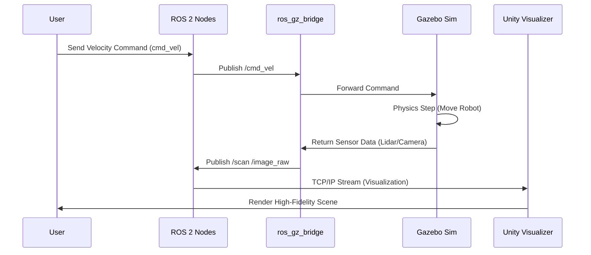

# Simulation Basics

## Why Simulate?

Simulation is a critical step in robotics development. It allows us to:
- **Test safely**: Crash a virtual robot without costing thousands of dollars.
- **Develop faster**: Iterate on code without waiting for hardware batteries to charge.
- **Scale**: Train AI agents on thousands of instances simultaneously.

## The Digital Twin

A "Digital Twin" is a virtual representation that serves as the real-time digital counterpart of a physical object or process. In robotics, this means a simulation that closely matches the physics, visuals, and sensor characteristics of the real robot. It connects directly to the [ROS 2 Nodes](../../module-1-ros2/intro.md) you built in Module 1.

## Diagram: Digital Twin Architecture

## Tools We Will Use

- **Gazebo**: The de-facto standard open-source physics simulator for ROS.
- **Unity**: A game engine providing high-fidelity rendering and XR capabilities.

## Summary

We simulate to save time, money, and ensure safety. The Digital Twin concept integrates simulation deeply into the development lifecycle.

## What's Next?

Learn how to define your environment by creating a [Gazebo World File](./02-gazebo-world.md).
