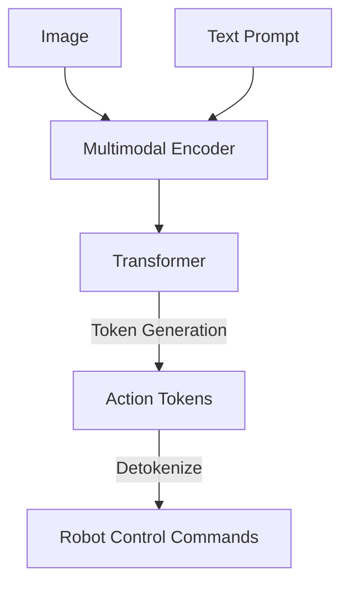

# Foundations of VLA (Vision-Language-Action)

## From LLMs to VLAs

Large Language Models (LLMs) like GPT-4 operate on text. To control robots, we need models that understand the physical world.
**Vision-Language-Action (VLA)** models bridge this gap by integrating:
- **Vision**: Understanding the scene (cameras, depth).
- **Language**: Understanding instructions ("Pick up the red apple").
- **Action**: Generating low-level controls (joint angles, velocities).

## Key Examples

- **RT-2 (Robotic Transformer 2)**: A VLA model trained on internet-scale text and images, plus robotic trajectory data. It directly outputs action tokens.
- **PaLM-E**: An embodied multimodal language model that injects continuous sensor data into the language model's embedding space.

## The Promise

VLAs enable general-purpose robots that can perform tasks they haven't explicitly been trained on, by reasoning about the world and instructions.

## Summary

VLAs move beyond simple text processing to embodied reasoning, allowing robots to understand and interact with the physical world in human-like ways.

## What's Next?

This concludes the core curriculum modules. You can revisit [Module 1](../../module-1-ros2/intro.md) to review ROS 2 concepts or explore the [Hardware Guides](../../../hardware/intro.md) to start building.
