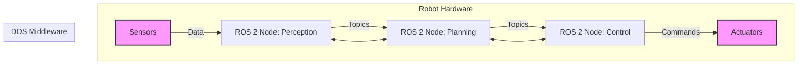

# Introduction to ROS 2

## What is ROS 2?

ROS 2 (Robot Operating System 2) is an open-source set of software libraries and tools that help you build robot applications. It is the successor to the original ROS, redesigned to address gaps in the initial design such as real-time constraints, security, and embedded systems support.

## Why ROS 2?

- **Real-time Capability**: Support for real-time systems.
- **Security**: Built-in security features (SROS 2).
- **Modern Architecture**: Uses DDS (Data Distribution Service) for communication.
- **Cross-platform**: Runs on Linux, Windows, and macOS.

## Core Concepts

In this module, we will cover:
1. **Nodes**: Executable processes that perform computation.
2. **Topics**: Named buses over which nodes exchange messages (Publisher/Subscriber).
3. **Services**: Request/Reply communication pattern.
4. **Actions**: Long-running tasks with feedback and preemption.

## Diagram: Robotic Nervous System

## Summary

ROS 2 provides the plumbing for your robot, allowing different parts (sensors, control, planning) to communicate seamlessly.

## What's Next?

Let's get your hands dirty. Proceed to [Installation & Setup](./02-installation.md) to configure your development environment. Once you've mastered ROS 2, you'll be ready to simulate it in [Module 2: Gazebo](../../module-2-gazebo-unity/intro.md).
