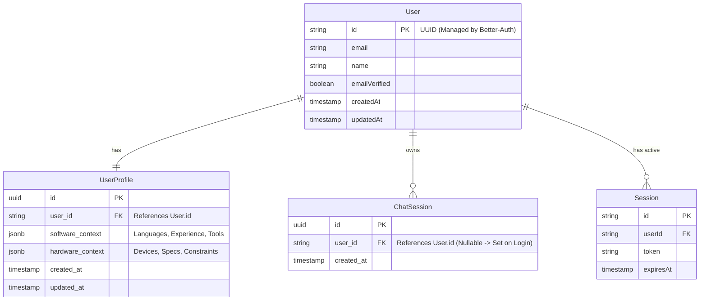

# Data Model: Authentication & User Profile

## Entity Relationship Diagram



## Schema Definitions (PostgreSQL)

### 1. `users`, `session`, `account` (Managed by Better-Auth)
Standard Better-Auth schema. No manual SQL or Alembic migration needed for *creation*, but we need to acknowledge them.

### 2. `user_profiles` (Managed by Application/Alembic)

| Column | Type | Constraints | Description |
|--------|------|-------------|-------------|
| `id` | UUID | PK, Default: `gen_random_uuid()` | Unique Profile ID |
| `user_id` | TEXT | FK -> `user.id`, ON DELETE CASCADE, NOT NULL, UNIQUE | One-to-one link to auth user |
| `software_context` | JSONB | NOT NULL | User's technical background |
| `hardware_context` | JSONB | NOT NULL | User's hardware capabilities |
| `created_at` | TIMESTAMP | Default: `now()` | |
| `updated_at` | TIMESTAMP | Default: `now()` | |

**JSONB Schema for `software_context`**:
```json
{
  "languages": ["Python", "Cpp"],
  "experience_level": "Intermediate",
  "preferred_tools": ["VSCode", "ROS"]
}
```

**JSONB Schema for `hardware_context`**:
```json
{
  "devices": ["Simulation", "RobotArm"],
  "specifications": { "gpu": "RTX3060", "ram": "16GB" },
  "constraints": ["NoInternet"]
}
```

### 3. `chat_sessions` Updates

- **Alter Column**: `user_id` needs to reference `user(id)`.
- **Note**: `user.id` in Better-Auth is likely `TEXT` or `VARCHAR`, ensuring compatibility with `UUID` if stored as text uuid, or simply change `chat_sessions.user_id` to `TEXT` to match Better-Auth default.
- **Decision**: Change `chat_sessions.user_id` to `TEXT` to align with Better-Auth's default ID type.

## Validation Rules

1.  **Unique Profile**: A user can have only one profile.
2.  **Mandatory Fields**: `software_context` and `hardware_context` must not be null.
3.  **Strict Enums**: Application logic must enforce that values in JSONB match the predefined options from the Spec.
